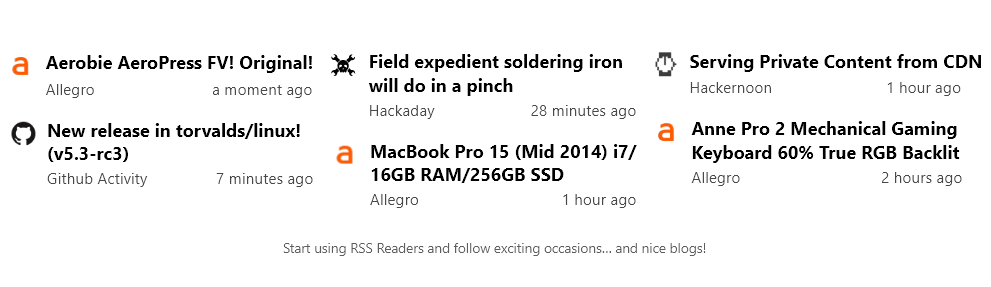
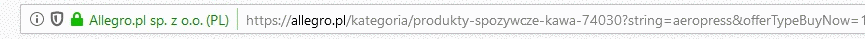

[![Contributors][contributors-shield]][contributors-url]
[![Forks][forks-shield]][forks-url]
[![Stargazers][stars-shield]][stars-url]
[![Issues][issues-shield]][issues-url]
[![MIT License][license-shield]][license-url]

<br />
<p align=center>
	<a src="https://alegro.pl">
		
	</a>
	<h3 align=center>AllegroRSS</h3>
	<p align="center">
		Generate RSS channel with every search filters!<br>
		The fastest of all! Based on Allegro REST API!
	</p>
</p>

<p align="center">
	
</p>

## About the project
Allegro disabled the possibility of making your own RSS channel in 2018. A lot of people used this for all time notifications about occasions. Lately [similiar project](https://github.com/MK-PL/AllegroRSS), based on web-scrapping, JS and... Electron(?) which is ineffective was created by [MK-PL]("https://github.com/MK-PL")

## Installation

Just install [Docker](https://docker.com) and docker-compose and type in terminal:

```
git clone https://github.com/emptycodes/AllegroRSS
cd AllegroRSS
docker-compose build
docker-compose run
```

## Usage
<p align="center">
	
</p>

Start searching for things that you're interested in, chose category, filters, and change domaina name to app URI. It couldn't be easier!

Add RSS channel to your reader! Ex. [TelegramRSS Bot](https://github.com/JuniorJPDJ/telegram-rss)

## To-Do list

- [x] Dockerfile for the project!
- [ ] Make possibility to hide promoted offers in URL (now this option is in `config.yaml` only)

## License
Distributed under the MIT License. See `LICENSE` for more information.

## Acknowledgements
* [@JuniorJPDJ](https://github.com/juniorjpdj/) - for reviewing code and motivation (this project would never have been written)
* [MK-PL/AllegroRSS](https://github.com/MK-PL/AllegroRSS) - for the idea! I appreciate your work! I could buy you a ~~beer~~ cup of coffee
* [othneildrew/Best-README-Template](https://github.com/othneildrew/Best-README-Template) - for making Github more beautiful!

## Contact
Hubert "empty" Śliwiński - contact@empty.codes

[contributors-shield]: https://img.shields.io/github/contributors/emptycodes/AllegroRSS.svg?style=flat-square
[contributors-url]: https://github.com/emptycodes/AllegroRSS/graphs/contributors
[forks-shield]: https://img.shields.io/github/forks/emptycodes/AllegroRSS.svg?style=flat-square
[forks-url]: https://github.com/emptycodes/AllegroRSS/network/members
[stars-shield]: https://img.shields.io/github/stars/emptycodes/AllegroRSS.svg?style=flat-square
[stars-url]: https://github.com/emptycodes/AllegroRSS/stargazers
[issues-shield]: https://img.shields.io/github/issues/emptycodes/AllegroRSS.svg?style=flat-square
[issues-url]: https://github.com/emptycodes/AllegroRSS/issues
[license-shield]: https://img.shields.io/github/license/emptycodes/AllegroRSS?style=flat-square
[license-url]: https://github.com/emptycodes/AllegroRSS/blob/master/LICENSE
